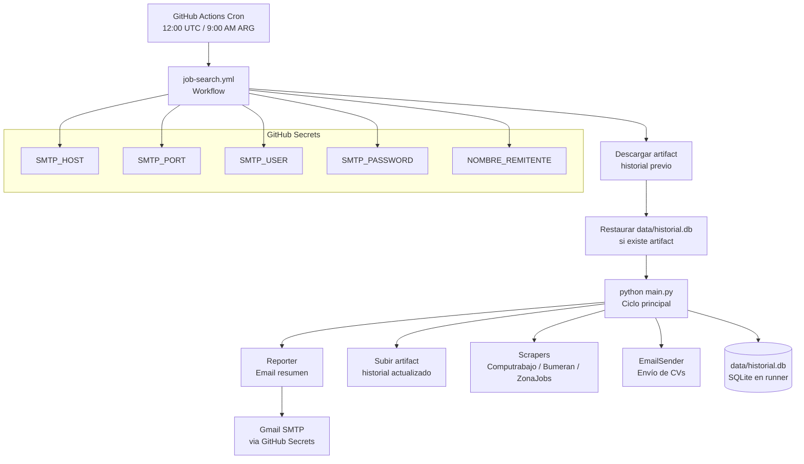
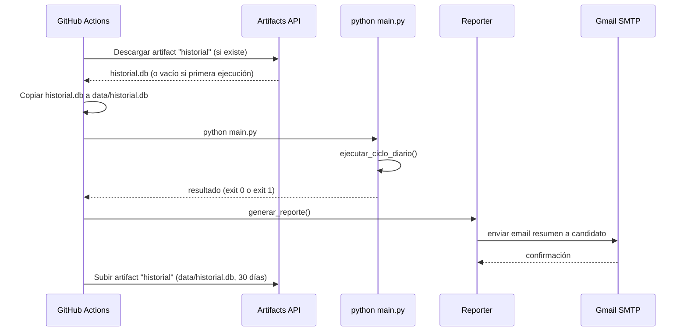

# Documento de Diseño: github-actions-scheduler

## Descripción General

Esta funcionalidad reemplaza el Windows Task Scheduler por un workflow de GitHub Actions que ejecuta el ciclo diario de búsqueda y envío de CVs a las 9:00 AM hora Argentina (12:00 UTC). Agrega persistencia del historial SQLite entre ejecuciones mediante GitHub Actions Artifacts, y un reporte diario por email al candidato con el resumen de cada ciclo.

Los tres cambios principales son: (1) el workflow YAML que orquesta la ejecución en ubuntu-latest, (2) la clase `Reporter` en `core/reporter.py` que genera y envía el email de resumen, y (3) la integración del reporter al final de `main.py`.

---

## Arquitectura General



---

## Flujo de Ejecución del Workflow



---

## Componentes Nuevos y Modificados

### 1. `.github/workflows/job-search.yml` — Workflow principal

Archivo YAML que define el trigger cron, los pasos de restauración del historial, ejecución del script Python, envío del reporte y persistencia del artifact.

**Responsabilidades:**
- Disparar la ejecución diaria a las 12:00 UTC
- Inyectar los GitHub Secrets como variables de entorno
- Gestionar el ciclo de vida del artifact `historial`
- Instalar Chrome/ChromeDriver para Selenium headless
- Fallar con exit code != 0 si hay error crítico

### 2. `core/reporter.py` — Clase Reporter

Genera el email de reporte diario y lo envía al candidato usando el `EmailSender` existente.

**Responsabilidades:**
- Consultar el historial del día actual via `HistoryManager`
- Construir el cuerpo del reporte a partir del template
- Enviar el email sin adjunto CV (solo texto)
- Manejar el caso de cero envíos (indicar motivo)

### 3. `templates/reporte_diario.txt` — Template del reporte

Plantilla de texto para el email de resumen diario.

### 4. `main.py` — Modificación

Integrar la llamada al `Reporter` al final de `ejecutar_ciclo_diario()`, pasando los contadores de éxitos/errores y la lista de registros del día.

---

## Diseño del Workflow YAML

```yaml
# .github/workflows/job-search.yml
name: Job Search Automation

on:
  schedule:
    - cron: '0 12 * * *'   # 12:00 UTC = 09:00 AM Argentina (UTC-3)
  workflow_dispatch:         # permite ejecución manual desde la UI

jobs:
  run-job-search:
    runs-on: ubuntu-latest
    timeout-minutes: 60

    steps:
      # 1. Checkout del repositorio (incluye assets/cv.pdf)
      - name: Checkout
        uses: actions/checkout@v4

      # 2. Configurar Python
      - name: Setup Python
        uses: actions/setup-python@v5
        with:
          python-version: '3.11'

      # 3. Instalar dependencias Python
      - name: Install dependencies
        run: pip install -r requirements.txt

      # 4. Instalar Chrome para Selenium headless
      - name: Install Chrome
        run: |
          sudo apt-get update -q
          sudo apt-get install -y chromium-browser

      # 5. Descargar artifact del historial previo (si existe)
      - name: Download historial artifact
        uses: actions/download-artifact@v4
        with:
          name: historial
          path: data/
        continue-on-error: true   # no falla si es la primera ejecución

      # 6. Ejecutar ciclo principal
      - name: Run job search
        env:
          SMTP_HOST: ${{ secrets.SMTP_HOST }}
          SMTP_PORT: ${{ secrets.SMTP_PORT }}
          SMTP_USER: ${{ secrets.SMTP_USER }}
          SMTP_PASSWORD: ${{ secrets.SMTP_PASSWORD }}
          NOMBRE_REMITENTE: ${{ secrets.NOMBRE_REMITENTE }}
          RUTA_CV: assets/cv.pdf
        run: python main.py

      # 7. Subir historial actualizado como artifact (siempre, incluso si hubo errores)
      - name: Upload historial artifact
        if: always()
        uses: actions/upload-artifact@v4
        with:
          name: historial
          path: data/historial.db
          retention-days: 30
          overwrite: true
```

**Notas de diseño:**
- `continue-on-error: true` en el paso de descarga permite la primera ejecución sin artifact previo
- `if: always()` en la subida garantiza que el historial se persiste aunque el ciclo falle parcialmente
- `workflow_dispatch` permite disparar manualmente para pruebas
- `timeout-minutes: 60` evita ejecuciones colgadas que consuman minutos de Actions
- `overwrite: true` reemplaza el artifact anterior con el nuevo (evita acumulación)

---

## Diseño de la Clase Reporter

```python
# core/reporter.py

class Reporter:
    def __init__(self, history: HistoryManager, email_config: EmailConfig):
        """
        Precondición: history inicializado, email_config con credenciales válidas.
        Postcondición: instancia lista para generar y enviar reportes.
        """

    def generar_reporte(
        self,
        fecha: date,
        envios_exitosos: int,
        envios_error: int,
        registros: list[SendRecord],
        motivo_sin_envios: str | None = None
    ) -> str:
        """
        Genera el cuerpo del email de reporte a partir del template.

        Precondición: fecha válida, contadores >= 0.
        Postcondición: retorna string con el cuerpo del reporte listo para enviar.
        Si envios_exitosos == 0 y envios_error == 0, incluye motivo_sin_envios.
        """

    def enviar_reporte(
        self,
        destinatario: str,
        fecha: date,
        envios_exitosos: int,
        envios_error: int,
        registros: list[SendRecord],
        motivo_sin_envios: str | None = None
    ) -> bool:
        """
        Genera y envía el email de reporte al destinatario.

        Precondición: destinatario es email válido.
        Postcondición: retorna True si el email fue enviado, False si hubo error.
        El email NO lleva CV adjunto (solo texto plano).
        Se envía incluso si algunos envíos del ciclo fallaron.
        """

    def _construir_lineas_envios(self, registros: list[SendRecord]) -> str:
        """
        Formatea la lista de registros del día como texto legible.
        Cada línea: empresa | email_destino | tipo | estado | notas
        """
```

**Decisión de diseño**: el `Reporter` no hereda de `EmailSender` sino que lo usa internamente. Esto evita acoplar la lógica de reporte con la lógica de envío de CVs. El `Reporter` construye un mensaje MIME simple (sin adjunto) usando `smtplib` directamente, o reutiliza el método `_enviar` de `EmailSender` si se expone como método público.

**Alternativa elegida**: exponer un método `enviar_texto` en `EmailSender` que envíe sin adjunto, y que `Reporter` lo use. Esto mantiene toda la lógica SMTP centralizada en `EmailSender`.

---

## Formato del Email de Reporte

### Asunto
```
[Job Search] Reporte diario - {fecha} | {N} envíos exitosos
```

### Cuerpo (template `templates/reporte_diario.txt`)

```
Reporte de búsqueda laboral automatizada
Fecha: {fecha}
========================================

RESUMEN
-------
Envíos exitosos : {envios_exitosos}
Errores         : {envios_error}
Total procesado : {total}

{seccion_envios}

{seccion_sin_envios}

---
Este reporte fue generado automáticamente por job-search-automation.
Repositorio: https://github.com/Pablo-Carabajal/job-search-automation
```

### Sección de envíos (cuando hay registros)
```
DETALLE DE ENVÍOS
-----------------
{lineas_envios}
```

Cada línea de envío:
```
• {empresa} <{email_destino}>
  Tipo   : {tipo_legible}
  Puesto : {notas}
  Estado : {estado_emoji} {estado}
```

Donde:
- `tipo_legible`: "Oferta de portal" o "Envío espontáneo (fallback)"
- `estado_emoji`: ✓ para enviado, ✗ para error, — para omitido

### Sección sin envíos (cuando no hay registros)
```
SIN ENVÍOS HOY
--------------
Motivo: {motivo_sin_envios}
```

Motivos posibles:
- "Todas las empresas encontradas están en período de cooldown (20 días)"
- "No se encontraron ofertas en los portales y no hay empresas locales habilitadas"
- "Error en el ciclo de scraping — revisar logs"

---

## Modificación de `main.py`

La función `ejecutar_ciclo_diario()` debe:

1. Acumular la lista de `SendRecord` generados durante el ciclo (ya se hace implícitamente via `history`)
2. Al final, consultar `history.obtener_historial(desde=date.today())` para obtener los registros del día
3. Instanciar `Reporter` y llamar a `reporter.enviar_reporte()`

```python
# Al final de ejecutar_ciclo_diario(), antes del log de cierre:

CANDIDATO_EMAIL = "carabajalpabloezequiel@gmail.com"

registros_hoy = history.obtener_historial(desde=date.today())
motivo = None
if envios_exitosos == 0 and envios_error == 0:
    motivo = "Todas las empresas encontradas están en período de cooldown (20 días)"

reporter = Reporter(history, email_config)
reporter.enviar_reporte(
    destinatario=CANDIDATO_EMAIL,
    fecha=date.today(),
    envios_exitosos=envios_exitosos,
    envios_error=envios_error,
    registros=registros_hoy,
    motivo_sin_envios=motivo
)
```

**Nota**: el email del candidato puede moverse a `Config` como `CANDIDATO_EMAIL = os.getenv("CANDIDATO_EMAIL", "carabajalpabloezequiel@gmail.com")` para mayor flexibilidad.

---

## Estrategia de Persistencia del Historial

### Problema
El runner de GitHub Actions es efímero: cada ejecución parte de un entorno limpio. El archivo `data/historial.db` se pierde al terminar el job.

### Solución: GitHub Actions Artifacts

```
Ejecución N:
  1. Descargar artifact "historial" → data/historial.db  (si existe)
  2. Ejecutar ciclo (lee y escribe data/historial.db)
  3. Subir data/historial.db como artifact "historial"   (sobreescribe)

Ejecución N+1:
  1. Descargar artifact "historial" → data/historial.db  (tiene datos de N)
  2. ...
```

### Comportamiento en primera ejecución
- El paso de descarga falla silenciosamente (`continue-on-error: true`)
- `data/historial.db` no existe → `HistoryManager.__init__` crea la tabla vacía
- El ciclo arranca sin historial previo (comportamiento correcto)

### Retención
- 30 días de retención en el artifact
- El artifact se sobreescribe en cada ejecución (`overwrite: true`)
- Solo existe un artifact activo a la vez (el más reciente)

### Limitaciones conocidas
- Si dos ejecuciones corren en paralelo (ej: manual + cron simultáneos), puede haber race condition en el artifact. Mitigación: el cron diario hace que esto sea extremadamente improbable.
- GitHub retiene artifacts hasta 30 días; si el sistema no corre por más de 30 días, el historial se pierde. Mitigación: documentar en README.

---

## Configuración de GitHub Secrets

Los siguientes secrets deben configurarse en `Settings > Secrets and variables > Actions` del repositorio:

| Secret | Descripción | Ejemplo |
|--------|-------------|---------|
| `SMTP_HOST` | Servidor SMTP | `smtp.gmail.com` |
| `SMTP_PORT` | Puerto SMTP | `587` |
| `SMTP_USER` | Email del remitente | `tu_cuenta@gmail.com` |
| `SMTP_PASSWORD` | Contraseña de aplicación Gmail | `xxxx xxxx xxxx xxxx` |
| `NOMBRE_REMITENTE` | Nombre completo del candidato | `Pablo Ezequiel Carabajal` |

**Nota sobre Gmail**: se debe usar una "Contraseña de aplicación" (App Password), no la contraseña de la cuenta. Se genera en `Cuenta de Google > Seguridad > Verificación en dos pasos > Contraseñas de aplicación`.

**`RUTA_CV` no es un secret**: el CV está commiteado en `assets/cv.pdf` y se inyecta como variable de entorno normal (`RUTA_CV: assets/cv.pdf`) directamente en el workflow YAML.

---

## Consideraciones de Chrome/Selenium en Linux

El runner `ubuntu-latest` no tiene Chrome preinstalado. Opciones:

### Opción A (elegida): `chromium-browser` via apt
```yaml
- name: Install Chrome
  run: |
    sudo apt-get update -q
    sudo apt-get install -y chromium-browser
```
Selenium Manager (incluido en Selenium 4.6+) detecta automáticamente el binario de Chromium y descarga el ChromeDriver compatible. No requiere configuración adicional.

### Opción B: `actions/setup-chrome`
```yaml
- uses: browser-actions/setup-chrome@v1
```
Más explícito pero agrega una dependencia de action de terceros.

### Configuración del WebDriver en Linux
Los scrapers que usan Selenium deben asegurarse de pasar las opciones headless correctas para Linux:
```python
options = webdriver.ChromeOptions()
options.add_argument("--headless")
options.add_argument("--no-sandbox")          # requerido en Linux CI
options.add_argument("--disable-dev-shm-usage")  # evita crashes por memoria compartida
```

---

## Archivos a Crear/Modificar

| Archivo | Acción | Descripción |
|---------|--------|-------------|
| `.github/workflows/job-search.yml` | Crear | Workflow completo de GitHub Actions |
| `core/reporter.py` | Crear | Clase Reporter para reporte diario |
| `templates/reporte_diario.txt` | Crear | Template del email de reporte |
| `main.py` | Modificar | Integrar llamada al Reporter al final del ciclo |
| `core/email_sender.py` | Modificar | Agregar método `enviar_texto()` sin adjunto CV |

---

## Manejo de Errores

| Escenario | Comportamiento |
|-----------|----------------|
| Artifact no existe (primera ejecución) | `continue-on-error: true` — arranca con historial vacío |
| Fallo al subir artifact | El workflow falla con warning, pero el ciclo ya completó |
| Fallo al enviar reporte | Log de error, no interrumpe el ciclo ni el upload del artifact |
| Chrome no disponible en runner | El scraper Selenium falla con log de error, los otros scrapers continúan |
| Secret no configurado | `Config` retorna `None`, `EmailSender` detecta credenciales vacías y falla con log de error |

---

## Estrategia de Testing

### Unit Testing
- `test_reporter_genera_cuerpo`: verifica que el cuerpo del reporte incluye fecha, contadores y lista de envíos
- `test_reporter_sin_envios`: verifica que el motivo aparece cuando no hay registros
- `test_reporter_formato_lineas`: verifica el formato de cada línea de envío

### Property-Based Testing (`hypothesis`)
- Propiedad: para cualquier lista de `SendRecord`, `generar_reporte()` siempre retorna un string no vacío
- Propiedad: el conteo de envíos exitosos en el reporte siempre coincide con el parámetro `envios_exitosos`

### Testing de integración
- Mock de SMTP para verificar que el reporte se envía sin adjunto
- Verificar que el asunto del reporte contiene la fecha correcta

---

## Dependencias

No se agregan dependencias externas nuevas. Todo se implementa con:
- `smtplib` + `email` (stdlib Python) — ya usado por `EmailSender`
- `sqlite3` (stdlib Python) — ya usado por `HistoryManager`
- GitHub Actions built-in actions: `actions/checkout@v4`, `actions/setup-python@v5`, `actions/upload-artifact@v4`, `actions/download-artifact@v4`


---

## Propiedades de Corrección

*Una propiedad es una característica o comportamiento que debe mantenerse verdadero en todas las ejecuciones válidas del sistema — esencialmente, una declaración formal sobre lo que el sistema debe hacer. Las propiedades sirven como puente entre las especificaciones legibles por humanos y las garantías de corrección verificables automáticamente.*

### Propiedad 1: Round-trip de persistencia de SendRecord

*Para cualquier* `SendRecord` válido, registrarlo mediante `HistoryManager.registrar_envio()` y luego consultarlo con `obtener_historial()` debe retornar un registro con los mismos campos (`empresa`, `email_destino`, `fecha_envio`, `tipo`, `estado`).

**Valida: Requisitos 2.4**

---

### Propiedad 2: Filtrado por rango de fechas

*Para cualquier* conjunto de `SendRecord` con fechas variadas y cualquier rango `[desde, hasta]`, todos los registros retornados por `obtener_historial(desde, hasta)` deben tener `fecha_envio` dentro del rango especificado, y ningún registro fuera del rango debe aparecer en los resultados.

**Valida: Requisitos 2.5**

---

### Propiedad 3: HistoryManager crea DB vacía cuando no existe archivo

*Para cualquier* ruta de archivo que no exista en el sistema de archivos, instanciar `HistoryManager` con esa ruta debe crear el archivo SQLite con el esquema correcto y `obtener_historial()` debe retornar una lista vacía.

**Valida: Requisitos 2.2**

---

### Propiedad 4: El reporte siempre contiene fecha y contadores

*Para cualquier* combinación de fecha válida, `envios_exitosos >= 0`, `envios_error >= 0` y lista de `SendRecord`, `Reporter.generar_reporte()` debe retornar un string no vacío que contenga la fecha, el valor de `envios_exitosos` y el valor de `envios_error`.

**Valida: Requisitos 3.1**

---

### Propiedad 5: El reporte incluye motivo cuando no hay envíos

*Para cualquier* string de motivo no vacío, cuando `envios_exitosos == 0` y `envios_error == 0`, el string retornado por `Reporter.generar_reporte()` debe contener el motivo proporcionado.

**Valida: Requisitos 3.2**

---

### Propiedad 6: El reporte se envía sin adjunto CV

*Para cualquier* contenido de reporte, cuando `Reporter.enviar_reporte()` invoca al EmailSender, el mensaje MIME construido no debe contener partes con `Content-Disposition: attachment`.

**Valida: Requisitos 3.4**

---

### Propiedad 7: Reporter maneja fallos SMTP sin propagar excepción

*Para cualquier* excepción lanzada por el servidor SMTP durante el envío del reporte, `Reporter.enviar_reporte()` debe retornar `False` sin lanzar excepción al llamador.

**Valida: Requisitos 3.5**

---

### Propiedad 8: Config lee variables de entorno correctamente

*Para cualquier* valor asignado a las variables de entorno `SMTP_HOST`, `SMTP_PORT`, `SMTP_USER`, `SMTP_PASSWORD` o `NOMBRE_REMITENTE`, `Config` debe retornar exactamente ese valor al acceder al atributo correspondiente.

**Valida: Requisitos 4.1**

---

### Propiedad 9: EmailSender retorna False con credenciales vacías

*Para cualquier* combinación donde `SMTP_USER` o `SMTP_PASSWORD` sean `None` o string vacío, `EmailSender._enviar()` debe retornar `False` sin lanzar excepción.

**Valida: Requisitos 4.4**

---

### Propiedad 10: Scrapers Selenium incluyen opciones requeridas de Linux

*Para cualquier* instancia de Scraper que use Selenium, el objeto `ChromeOptions` configurado debe contener los argumentos `--headless`, `--no-sandbox` y `--disable-dev-shm-usage`.

**Valida: Requisitos 5.2**

---

### Propiedad 11: El ciclo continúa cuando un Scraper falla

*Para cualquier* lista de scrapers donde uno o más lanzan excepción, `buscar_ofertas_todos_portales()` debe retornar las ofertas de los scrapers que sí funcionaron, sin propagar la excepción al llamador.

**Valida: Requisitos 6.1, 5.4**

---

### Propiedad 12: Activación del Fallback cuando no hay ofertas

*Para cualquier* ejecución donde todos los scrapers retornan listas vacías, el ciclo principal debe invocar el mecanismo de Fallback con empresas locales en lugar de terminar sin envíos.

**Valida: Requisitos 6.2**
