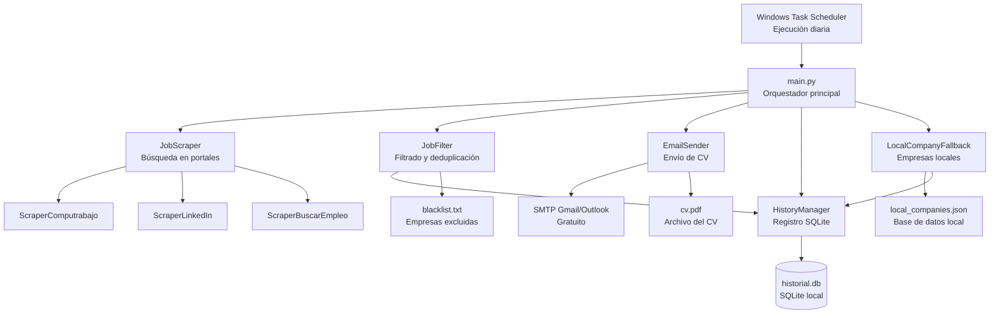
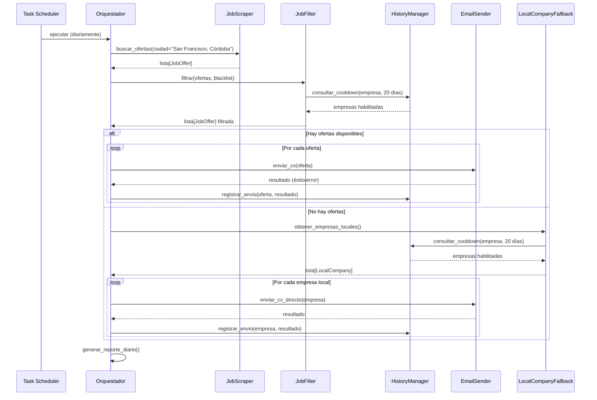

# Documento de Diseño: job-search-automation

## Descripción General

Sistema automatizado que busca ofertas laborales diariamente en portales gratuitos filtrando por San Francisco, Córdoba, Argentina, y envía el CV del usuario de forma automática. Incluye control anti-spam con cooldown de 20 días por empresa, fallback de envío directo a empresas locales cuando no hay ofertas en portales, y registro completo del historial de envíos.

El sistema corre en Windows como tarea programada, está construido en Python (más adecuado que Java para scraping web y automatización de emails, completamente gratuito y open source), y no depende de ninguna API paga.

### Por qué Python en lugar de Java

| Criterio | Python | Java |
|---|---|---|
| Scraping web | `requests` + `BeautifulSoup` / `Selenium` — ecosistema maduro | HtmlUnit / Jsoup — funcional pero más verboso |
| Envío de emails | `smtplib` nativo en stdlib | JavaMail — dependencia externa |
| Base de datos local | `sqlite3` nativo en stdlib | JDBC + driver externo |
| Tarea programada Windows | Script `.py` directo en Task Scheduler | Requiere JAR + JVM configurada |
| Curva de aprendizaje para automatización | Baja | Media-alta |

---

## Arquitectura General



---

## Flujo Principal de Ejecución



---

## Componentes y Interfaces

### 1. JobOffer — Modelo de datos de oferta

```python
@dataclass
class JobOffer:
    id: str                  # hash único: empresa+puesto+fecha
    titulo: str
    empresa: str
    email_contacto: str | None
    url_oferta: str
    portal_origen: str       # "computrabajo" | "linkedin" | "buscaremp"
    fecha_publicacion: date
    descripcion: str
    ciudad: str              # siempre "San Francisco, Córdoba"
```

### 2. LocalCompany — Empresa local para fallback

```python
@dataclass
class LocalCompany:
    nombre: str
    email: str
    rubro: str
    direccion: str | None
```

### 3. SendRecord — Registro de envío

```python
@dataclass
class SendRecord:
    id: int
    empresa: str
    email_destino: str
    fecha_envio: date
    tipo: str        # "oferta_portal" | "empresa_local"
    estado: str      # "enviado" | "error" | "omitido"
    url_oferta: str | None
    notas: str | None
```

---

## Estructura de Base de Datos (SQLite)

```sql
-- historial.db

CREATE TABLE envios (
    id            INTEGER PRIMARY KEY AUTOINCREMENT,
    empresa       TEXT    NOT NULL,
    email_destino TEXT    NOT NULL,
    fecha_envio   TEXT    NOT NULL,  -- ISO 8601: YYYY-MM-DD
    tipo          TEXT    NOT NULL,  -- 'oferta_portal' | 'empresa_local'
    estado        TEXT    NOT NULL,  -- 'enviado' | 'error' | 'omitido'
    url_oferta    TEXT,
    notas         TEXT
);

CREATE INDEX idx_empresa_fecha ON envios (empresa, fecha_envio);
```

**Regla de cooldown**: una empresa está bloqueada si existe un registro con `estado = 'enviado'` y `fecha_envio >= hoy - 20 días`.

---

## Componentes Principales — Firmas y Especificaciones

### JobScraper

```python
class JobScraper:
    def __init__(self, ciudad: str = "San Francisco, Córdoba"):
        """Inicializa scrapers individuales para cada portal."""

    def buscar_ofertas(self) -> list[JobOffer]:
        """
        Precondición: ciudad configurada y no vacía.
        Postcondición: retorna lista (posiblemente vacía) de ofertas únicas.
        Cada oferta tiene id único (hash). Errores de red se loguean y no
        interrumpen el proceso (fail-soft por portal).
        """

class ScraperComputrabajo:
    BASE_URL = "https://www.computrabajo.com.ar"

    def scrape(self) -> list[JobOffer]:
        """
        Usa requests + BeautifulSoup.
        URL: /empleos-en-san-francisco-cordoba
        Extrae: título, empresa, fecha, URL de detalle.
        Sigue paginación hasta max_pages=5.
        Respeta robots.txt y agrega delay aleatorio entre requests (2-5s).
        """

class ScraperLinkedIn:
    def scrape(self) -> list[JobOffer]:
        """
        Usa Selenium (headless Chrome) para LinkedIn Jobs público.
        Filtro: location="San Francisco, Córdoba, Argentina"
        Sin login requerido (búsqueda pública).
        Extrae hasta 25 resultados por ejecución.
        """

class ScraperBuscarEmpleo:
    def scrape(self) -> list[JobOffer]:
        """
        Usa requests + BeautifulSoup.
        Sitio: buscaremp.com.ar
        Filtro por provincia Córdoba + ciudad San Francisco.
        """
```

### JobFilter

```python
class JobFilter:
    def __init__(self, history: HistoryManager, blacklist_path: str):
        """
        Carga blacklist desde archivo de texto (una empresa por línea).
        Blacklist inicial incluye: "ZF Sachs S.A.", "ZF Sachs", "ZF".
        """

    def filtrar(self, ofertas: list[JobOffer]) -> list[JobOffer]:
        """
        Precondición: lista de ofertas válidas.
        Postcondición: retorna ofertas donde:
          - empresa NO está en blacklist (case-insensitive)
          - empresa NO tiene envío en los últimos 20 días
          - oferta tiene email_contacto o url_oferta válida
        """

    def _en_blacklist(self, empresa: str) -> bool:
        """Comparación case-insensitive y por substring."""

    def _en_cooldown(self, empresa: str) -> bool:
        """Delega a HistoryManager.esta_en_cooldown()."""
```

### HistoryManager

```python
class HistoryManager:
    def __init__(self, db_path: str = "data/historial.db"):
        """Crea la base de datos y tabla si no existen."""

    def esta_en_cooldown(self, empresa: str, dias: int = 20) -> bool:
        """
        Precondición: empresa no vacía, dias > 0.
        Postcondición: True si existe envío exitoso en los últimos `dias` días.
        Consulta: SELECT COUNT(*) WHERE empresa=? AND estado='enviado'
                  AND fecha_envio >= date('now', '-N days')
        """

    def registrar_envio(self, record: SendRecord) -> None:
        """
        Precondición: record con campos obligatorios completos.
        Postcondición: registro insertado en tabla envios.
        """

    def obtener_historial(self,
                          desde: date | None = None,
                          hasta: date | None = None) -> list[SendRecord]:
        """Retorna registros filtrados por rango de fechas."""

    def exportar_csv(self, ruta: str) -> None:
        """Exporta historial completo a CSV para revisión manual."""
```

### EmailSender

```python
class EmailSender:
    def __init__(self, config: EmailConfig):
        """
        EmailConfig contiene: smtp_host, smtp_port, usuario, password,
        nombre_remitente, ruta_cv, asunto_template, cuerpo_template.
        Credenciales leídas desde variables de entorno o archivo .env
        (nunca hardcodeadas).
        """

    def enviar_cv(self, oferta: JobOffer) -> bool:
        """
        Precondición: oferta.email_contacto no es None.
        Postcondición: email enviado con CV adjunto; retorna True si éxito.
        Usa smtplib + MIME multipart.
        Asunto personalizado con nombre empresa y puesto.
        Adjunta cv.pdf desde ruta configurada.
        """

    def enviar_cv_directo(self, empresa: LocalCompany) -> bool:
        """
        Igual que enviar_cv pero para empresas locales sin oferta activa.
        Asunto: "Presentación espontánea - [nombre]"
        """

    def _construir_mensaje(self,
                           destinatario: str,
                           asunto: str,
                           cuerpo: str) -> MIMEMultipart:
        """Construye mensaje MIME con texto y adjunto CV."""
```

### LocalCompanyFallback

```python
class LocalCompanyFallback:
    def __init__(self, db_path: str = "data/local_companies.json",
                 history: HistoryManager = None):
        """Carga lista de empresas locales desde JSON."""

    def obtener_empresas_habilitadas(self) -> list[LocalCompany]:
        """
        Precondición: archivo JSON existe y es válido.
        Postcondición: retorna empresas que NO están en cooldown de 20 días
        y NO están en blacklist.
        Orden: aleatorio para distribuir envíos uniformemente.
        """
```

---

## Algoritmos Clave

### Algoritmo de Scraping con Fail-Soft

```pascal
PROCEDURE buscar_ofertas_todos_portales()
  INPUT: lista de scrapers configurados
  OUTPUT: lista consolidada de JobOffer

  SEQUENCE
    todas_ofertas ← lista vacía
    
    FOR cada scraper IN scrapers DO
      TRY
        ofertas ← scraper.scrape()
        todas_ofertas ← todas_ofertas + ofertas
        esperar(delay_aleatorio entre 3 y 8 segundos)
      CATCH error DE RED O TIMEOUT
        loguear("Portal no disponible: " + scraper.nombre)
        CONTINUE  // no interrumpir por fallo de un portal
      END TRY
    END FOR
    
    // Deduplicar por id (hash empresa+puesto)
    resultado ← deduplicar(todas_ofertas)
    RETURN resultado
  END SEQUENCE
END PROCEDURE
```

### Algoritmo de Cooldown 20 Días

```pascal
PROCEDURE esta_en_cooldown(empresa, dias=20)
  INPUT: nombre de empresa, cantidad de días
  OUTPUT: booleano

  SEQUENCE
    fecha_limite ← hoy - dias días
    
    count ← SQL(
      "SELECT COUNT(*) FROM envios
       WHERE empresa = ? 
       AND estado = 'enviado'
       AND fecha_envio >= ?",
      empresa, fecha_limite
    )
    
    RETURN count > 0
  END SEQUENCE
END PROCEDURE
```

### Algoritmo Principal de Orquestación

```pascal
PROCEDURE ejecutar_ciclo_diario()
  SEQUENCE
    loguear("Inicio ciclo: " + ahora())
    
    // Fase 1: Scraping
    ofertas_raw ← scraper.buscar_ofertas()
    loguear("Ofertas encontradas: " + len(ofertas_raw))
    
    // Fase 2: Filtrado
    ofertas_validas ← filtro.filtrar(ofertas_raw)
    loguear("Ofertas habilitadas para envío: " + len(ofertas_validas))
    
    // Fase 3: Envío o Fallback
    IF len(ofertas_validas) > 0 THEN
      FOR cada oferta IN ofertas_validas DO
        exito ← sender.enviar_cv(oferta)
        estado ← "enviado" SI exito SINO "error"
        history.registrar_envio(crear_record(oferta, estado))
        esperar(delay_entre_envios: 30-60 segundos)
      END FOR
    ELSE
      loguear("Sin ofertas. Activando fallback empresas locales.")
      empresas ← fallback.obtener_empresas_habilitadas()
      
      // Limitar a máximo 10 envíos por día en fallback
      empresas ← empresas[:10]
      
      FOR cada empresa IN empresas DO
        exito ← sender.enviar_cv_directo(empresa)
        estado ← "enviado" SI exito SINO "error"
        history.registrar_envio(crear_record(empresa, estado))
        esperar(delay_entre_envíos: 60-120 segundos)
      END FOR
    END IF
    
    loguear("Ciclo completado: " + ahora())
  END SEQUENCE
END PROCEDURE
```

---

## Estructura de Archivos del Proyecto

```
job-search-automation/
├── main.py                    # Punto de entrada, orquestador
├── config.py                  # Configuración centralizada
├── .env                       # Credenciales SMTP (no commitear)
├── run.bat                    # Script Windows para Task Scheduler
│
├── scrapers/
│   ├── __init__.py
│   ├── base_scraper.py        # Clase base abstracta
│   ├── computrabajo.py
│   ├── linkedin.py
│   └── buscaremp.py
│
├── core/
│   ├── __init__.py
│   ├── models.py              # JobOffer, LocalCompany, SendRecord
│   ├── job_filter.py
│   ├── history_manager.py
│   ├── email_sender.py
│   └── fallback.py
│
├── data/
│   ├── historial.db           # SQLite (generado automáticamente)
│   ├── local_companies.json   # Base de datos empresas locales
│   └── blacklist.txt          # Empresas excluidas
│
├── assets/
│   └── cv.pdf                 # CV del usuario
│
├── templates/
│   ├── asunto_oferta.txt
│   ├── cuerpo_oferta.txt
│   └── cuerpo_espontaneo.txt
│
└── logs/
    └── app.log                # Rotación diaria
```

---

## Tecnologías Seleccionadas (todas gratuitas/open source)

| Componente | Tecnología | Justificación |
|---|---|---|
| Lenguaje | Python 3.11+ | Ecosistema de scraping y automatización superior |
| Scraping HTML | `requests` + `BeautifulSoup4` | Liviano, sin overhead de browser |
| Scraping JS | `Selenium` + ChromeDriver | Para LinkedIn que requiere JS |
| Base de datos | `SQLite` (stdlib) | Sin servidor, archivo local, suficiente para el volumen |
| Email | `smtplib` + `email` (stdlib) | Nativo Python, sin dependencias externas |
| Variables de entorno | `python-dotenv` | Manejo seguro de credenciales |
| Logging | `logging` (stdlib) | Rotación de logs integrada |
| Scheduling | Windows Task Scheduler | Nativo Windows, sin dependencias |
| Dependencias totales externas | `requests`, `beautifulsoup4`, `selenium`, `python-dotenv` | Mínimas |

---

## Consideraciones Anti-Spam

### Técnicas de scraping responsable
- User-Agent rotativo que simula navegador real
- Delays aleatorios entre requests (2-5 segundos por página)
- Respetar `robots.txt` de cada portal
- Máximo 5 páginas de resultados por portal por ejecución
- Ejecutar una sola vez por día (Task Scheduler)

### Técnicas de envío de emails
- Delay de 30-60 segundos entre envíos de ofertas
- Delay de 60-120 segundos entre envíos de fallback
- Máximo 10 envíos por día en modo fallback
- Cooldown de 20 días por empresa (evita repetición)
- Asunto y cuerpo personalizados por empresa (no genérico masivo)
- Usar cuenta Gmail/Outlook dedicada para envíos (no la personal)
- Configurar SPF/DKIM si se usa dominio propio

### Blacklist inicial (`blacklist.txt`)
```
ZF Sachs S.A.
ZF Sachs
ZF Argentina
```

---

## Manejo de Errores

| Escenario | Comportamiento |
|---|---|
| Portal de scraping no disponible | Log de advertencia, continúa con otros portales |
| Email de oferta no encontrado | Registra como "omitido", continúa |
| Fallo SMTP al enviar | Registra como "error", reintenta 1 vez con delay de 60s |
| `historial.db` corrupto | Backup automático, recrea tabla vacía |
| `local_companies.json` inválido | Log de error crítico, detiene fallback (no el proceso completo) |
| ChromeDriver no instalado | Log de error, omite scraper LinkedIn, continúa con otros |

---

## Estrategia de Testing

### Unit Testing (`pytest`)
- `test_cooldown`: verifica que empresas con envío reciente sean bloqueadas
- `test_blacklist`: verifica exclusión de ZF Sachs y variantes
- `test_deduplicacion`: verifica que ofertas duplicadas se eliminen
- `test_email_builder`: verifica construcción correcta del mensaje MIME

### Property-Based Testing (`hypothesis`)
- Propiedad: para cualquier empresa en blacklist, `filtrar()` nunca la incluye
- Propiedad: para cualquier empresa con envío hace < 20 días, `esta_en_cooldown()` retorna True
- Propiedad: `registrar_envio()` seguido de `esta_en_cooldown()` siempre retorna True

### Testing de integración
- Mock de SMTP para verificar envíos sin enviar emails reales
- Mock de requests para verificar scraping sin acceder a internet

---

## Configuración de Windows Task Scheduler

`run.bat`:
```bat
@echo off
cd /d C:\job-search-automation
python main.py >> logs\app.log 2>&1
```

Configuración de la tarea:
- Disparador: Diariamente a las 09:00 AM
- Acción: ejecutar `run.bat`
- Condición: solo si hay conexión a internet
- Configuración: ejecutar aunque el usuario no esté logueado

---

## Dependencias Externas

```
requests>=2.31.0
beautifulsoup4>=4.12.0
selenium>=4.15.0
python-dotenv>=1.0.0
pytest>=7.4.0          # solo desarrollo
hypothesis>=6.88.0     # solo desarrollo
```

Instalación:
```
pip install requests beautifulsoup4 selenium python-dotenv
```

ChromeDriver: descargado automáticamente por `selenium-manager` (incluido en Selenium 4.6+).
