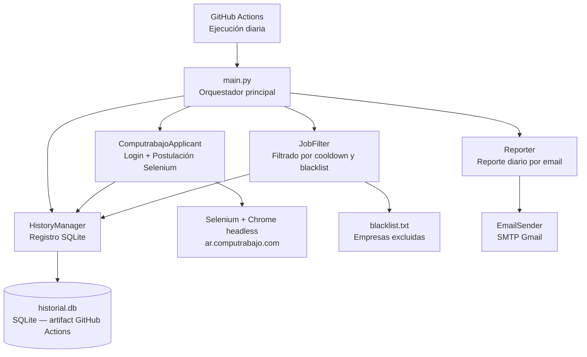
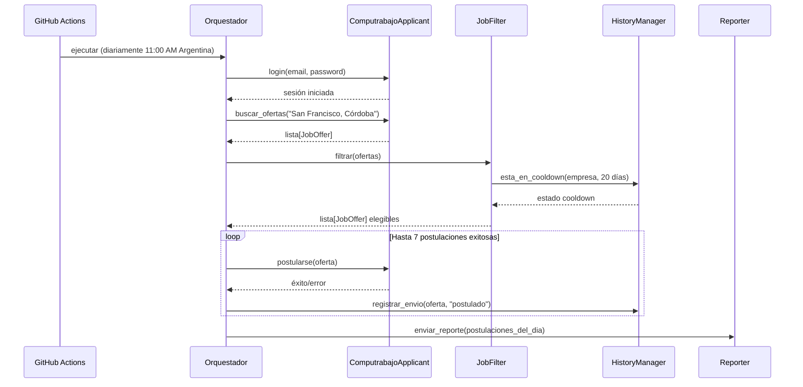

# Documento de Diseño: job-search-automation

## Descripción General

Sistema automatizado que se postula directamente a ofertas laborales en ar.computrabajo.com usando Selenium con login real. El sistema inicia sesión con las credenciales del usuario, busca ofertas en "San Francisco, Córdoba", hace clic en "Postularme" en cada oferta elegible (respetando cooldown de 20 días y blacklist), y envía un reporte diario por email con el resumen de postulaciones. El CV ya está cargado en el perfil de Computrabajo; Selenium solo ejecuta el clic de postulación.

El sistema corre en GitHub Actions con ejecución diaria automática.

---

## Arquitectura General



---

## Flujo Principal de Ejecución



---

## Componentes y Interfaces

### 1. JobOffer — Modelo de datos de oferta

```python
@dataclass
class JobOffer:
    id: str                  # hash único: empresa+puesto+url
    titulo: str
    empresa: str             # "desconocida" si no se identifica
    url_oferta: str
    portal_origen: str       # siempre "computrabajo"
    fecha_publicacion: date
    ciudad: str              # "San Francisco, Córdoba"
    categoria: str | None
```

### 2. SendRecord — Registro de postulación

```python
@dataclass
class SendRecord:
    id: int | None
    empresa: str
    email_destino: str       # "postulacion_directa" para Computrabajo
    fecha_envio: date
    tipo: str                # "postulacion_computrabajo"
    estado: str              # "postulado" | "error" | "omitido"
    url_oferta: str | None
    notas: str | None
```

---

## Estructura de Base de Datos (SQLite)

```sql
-- historial.db (sin cambios de esquema respecto al diseño anterior)

CREATE TABLE IF NOT EXISTS envios (
    id            INTEGER PRIMARY KEY AUTOINCREMENT,
    empresa       TEXT    NOT NULL,
    email_destino TEXT    NOT NULL,   -- "postulacion_directa"
    fecha_envio   TEXT    NOT NULL,   -- ISO 8601: YYYY-MM-DD
    tipo          TEXT    NOT NULL,   -- "postulacion_computrabajo"
    estado        TEXT    NOT NULL,   -- "postulado" | "error" | "omitido"
    url_oferta    TEXT,
    notas         TEXT
);
```

**Regla de cooldown**: una empresa está bloqueada si existe un registro con `estado = 'postulado'` y `fecha_envio >= hoy - 20 días`.

---

## Módulo Principal: ComputrabajoApplicant

```python
class ComputrabajoApplicant:
    BASE_URL = "https://ar.computrabajo.com"
    SEARCH_URL = "https://ar.computrabajo.com/trabajo-en-san-francisco-cordoba"
    MAX_POSTULACIONES_DIA = 7

    def __init__(self, email: str, password: str):
        """
        Inicializa el driver Chrome headless.
        Credenciales leídas desde variables de entorno (nunca hardcodeadas).
        """

    def login(self) -> bool:
        """
        Precondición: email y password no vacíos.
        Postcondición: sesión iniciada en ar.computrabajo.com; retorna True si éxito.
        Navega a la página de login, completa el formulario y verifica redirección exitosa.
        """

    def buscar_ofertas(self) -> list[JobOffer]:
        """
        Precondición: sesión iniciada (login() retornó True).
        Postcondición: retorna lista de ofertas encontradas en la búsqueda.
        Navega a SEARCH_URL, extrae título, empresa, URL de cada oferta listada.
        Sigue paginación hasta max_pages=5 o hasta que no haya más resultados.
        """

    def postularse(self, oferta: JobOffer) -> bool:
        """
        Precondición: sesión iniciada, oferta.url_oferta válida.
        Postcondición: clic en "Postularme" ejecutado; retorna True si éxito.
        Navega a la URL de la oferta, localiza el botón "Postularme" y hace clic.
        Si el botón no existe (ya postulado, oferta cerrada), retorna False con log.
        """

    def cerrar(self) -> None:
        """Cierra el driver de Selenium. Llamar siempre en bloque finally."""
```

---

## Algoritmos Clave

### Algoritmo de Login

```pascal
PROCEDURE login(email, password)
  INPUT: credenciales del usuario
  OUTPUT: booleano (éxito/fallo)

  SEQUENCE
    driver.get("https://ar.computrabajo.com/candidate/login")
    
    campo_email ← driver.find_element(By.NAME, "email")
    campo_email.send_keys(email)
    
    campo_password ← driver.find_element(By.NAME, "password")
    campo_password.send_keys(password)
    
    boton_login ← driver.find_element(By.TYPE, "submit")
    boton_login.click()
    
    // Esperar redirección post-login
    WebDriverWait(driver, 10).until(
      URL_CONTAINS("/candidate/")
    )
    
    IF "login" NOT IN driver.current_url THEN
      RETURN True
    ELSE
      loguear("Login fallido: credenciales incorrectas o CAPTCHA")
      RETURN False
    END IF
  END SEQUENCE
END PROCEDURE
```

### Algoritmo de Postulación Diaria

```pascal
PROCEDURE ejecutar_postulaciones(max=7)
  INPUT: máximo de postulaciones por día
  OUTPUT: lista de postulaciones realizadas

  SEQUENCE
    postulaciones ← lista vacía
    
    ofertas_raw ← applicant.buscar_ofertas()
    loguear("Ofertas encontradas: " + len(ofertas_raw))
    
    ofertas_elegibles ← filtro.filtrar(ofertas_raw)
    loguear("Ofertas elegibles: " + len(ofertas_elegibles))
    
    FOR cada oferta IN ofertas_elegibles DO
      IF len(postulaciones) >= max THEN
        BREAK
      END IF
      
      exito ← applicant.postularse(oferta)
      
      IF exito THEN
        history.registrar_envio(oferta, estado="postulado")
        postulaciones.agregar(oferta)
        loguear("Postulado: " + oferta.titulo + " en " + oferta.empresa)
        esperar(delay_aleatorio entre 3 y 8 segundos)
      ELSE
        history.registrar_envio(oferta, estado="error")
        loguear("Error al postularse: " + oferta.url_oferta)
      END IF
    END FOR
    
    // Si hay menos de 7 ofertas disponibles, se postula a todas las disponibles
    loguear("Postulaciones realizadas: " + len(postulaciones))
    RETURN postulaciones
  END SEQUENCE
END PROCEDURE
```

### Algoritmo de Cooldown (sin cambios)

```pascal
PROCEDURE esta_en_cooldown(empresa, dias=20)
  INPUT: nombre de empresa, cantidad de días
  OUTPUT: booleano

  SEQUENCE
    fecha_limite ← hoy - dias días
    
    count ← SQL(
      "SELECT COUNT(*) FROM envios
       WHERE empresa = ?
       AND estado = 'postulado'
       AND fecha_envio >= ?",
      empresa, fecha_limite
    )
    
    RETURN count > 0
  END SEQUENCE
END PROCEDURE
```

---

## Estructura de Archivos del Proyecto

```
job-search-automation/
├── main.py                          # Orquestador principal
├── config.py                        # Configuración centralizada
├── .env                             # Credenciales (no commitear)
│
├── core/
│   ├── __init__.py
│   ├── models.py                    # JobOffer, SendRecord
│   ├── computrabajo_applicant.py    # NUEVO: login + postulación Selenium
│   ├── job_filter.py                # Filtrado por cooldown y blacklist
│   ├── history_manager.py           # Registro SQLite
│   ├── email_sender.py              # Solo para reporte diario
│   └── reporter.py                  # Reporte diario por email
│
├── data/
│   ├── historial.db                 # SQLite (artifact GitHub Actions)
│   └── blacklist.txt                # Empresas excluidas
│
├── assets/
│   └── cv.pdf                       # CV (ya cargado en Computrabajo también)
│
├── templates/
│   └── reporte_diario.txt           # Template del reporte
│
├── .github/
│   └── workflows/
│       └── daily.yml                # GitHub Actions
│
└── logs/
    └── app.log
```

**Archivos eliminados respecto al diseño anterior:**
- `core/fallback.py` — sistema de fallback a empresas locales
- `data/local_companies.json` — base de datos de empresas locales
- `scrapers/bumeran.py` — scraper Bumeran
- `scrapers/zonajobs.py` — scraper ZonaJobs
- `templates/asunto_oferta.txt`, `cuerpo_oferta.txt`, `cuerpo_espontaneo.txt` — templates de email de postulación

---

## Variables de Entorno y GitHub Secrets

```bash
# .env (local, no commitear)
COMPUTRABAJO_EMAIL=carabajalpabloezequiel@gmail.com
COMPUTRABAJO_PASSWORD=<contraseña del usuario>

# Credenciales SMTP para reporte diario
SMTP_HOST=smtp.gmail.com
SMTP_PORT=587
SMTP_USER=carabajalpabloezequiel@gmail.com
SMTP_PASSWORD=<app password de Gmail>
NOMBRE_REMITENTE=Pablo Ezequiel Carabajal
CANDIDATO_EMAIL=carabajalpabloezequiel@gmail.com
```

**GitHub Secrets requeridos:**
- `COMPUTRABAJO_EMAIL`
- `COMPUTRABAJO_PASSWORD`
- `SMTP_HOST`, `SMTP_PORT`, `SMTP_USER`, `SMTP_PASSWORD`
- `NOMBRE_REMITENTE`, `CANDIDATO_EMAIL`

---

## Tecnologías

| Componente | Tecnología |
|---|---|
| Postulación | Selenium + Chrome headless |
| Base de datos | SQLite (stdlib) |
| Reporte diario | smtplib + email (stdlib) |
| Variables de entorno | python-dotenv |
| Scheduling | GitHub Actions (cron diario) |
| CI/CD | GitHub Actions ubuntu-latest |

---

## Manejo de Errores

| Escenario | Comportamiento |
|---|---|
| Login fallido (credenciales incorrectas) | Log de error crítico, detiene el ciclo, envía reporte con error |
| Login fallido (CAPTCHA) | Log de advertencia, reintenta 1 vez con delay de 30s |
| Botón "Postularme" no encontrado | Registra como "omitido", continúa con la siguiente oferta |
| Oferta ya postulada anteriormente | Detectado por cooldown antes de navegar; omitida |
| Error de red durante postulación | Registra como "error", continúa con la siguiente oferta |
| ChromeDriver no disponible | Error crítico, detiene el ciclo |
| Menos de 7 ofertas disponibles | Se postula a todas las disponibles sin error |

---

## Estrategia de Testing

### Unit Testing (`pytest`)
- `test_cooldown`: verifica que empresas con postulación reciente sean bloqueadas
- `test_blacklist`: verifica exclusión de empresas en blacklist
- `test_filtrado`: verifica que `JobFilter.filtrar()` combine correctamente cooldown y blacklist

### Property-Based Testing (`hypothesis`)
- Propiedad: para cualquier empresa en blacklist, `filtrar()` nunca la incluye
- Propiedad: para cualquier empresa con postulación hace < 20 días, `esta_en_cooldown()` retorna True

### Testing de integración
- Mock de Selenium para verificar flujo de login y postulación sin acceder a internet
- Mock de SMTP para verificar envío de reporte sin enviar emails reales

---

## Consideraciones de Automatización Responsable

- Delay aleatorio de 3-8 segundos entre postulaciones para no sobrecargar el servidor
- Máximo 7 postulaciones por día (límite conservador)
- Cooldown de 20 días por empresa evita postulaciones repetidas
- El sistema no crea cuentas ni realiza acciones fuera del flujo normal de un usuario
